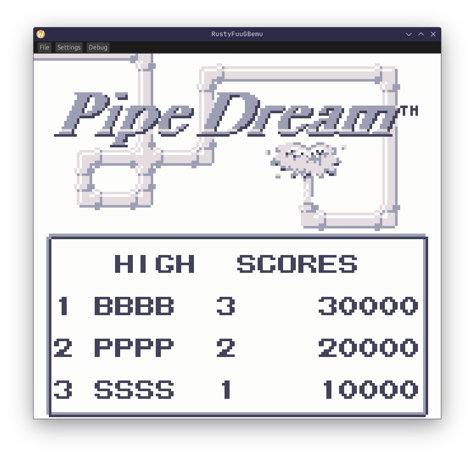

# RustyFuuGBEmu



DMG Gameboy emulator fully written in rust 🦀
The intent of the implementation is purely for educational / hobby purposes. There is currently no plan to support Gameboy Color / Super Gameboy games at the moment.

# Installation

The rust toolchain is required in order to install this binary.

To compile-run the executable directly:
```sh
cargo run
```

To simply build:
```sh
cargo build
```

To install the compiled binary to the rust `PATH` (`$HOME/.cargo/bin` on UNIX-like operating systems)

```sh
cargo install --path .
```

# TODO

- [X] Implement Memory
    - [ ] Implement Cartridge
        - [x] ROM Only
        - [X] MBC1
        - [ ] MBC2
        - [ ] MBC3
        - [ ] MBC4
        - [ ] MBC5
        - [ ] MBC6
        - [ ] MBC7
        - [ ] MMM01
        - [ ] M161
        - [ ] HuC1
        - [ ] HuC-3
        - [ ] Others
    - [x] Add Boot ROM
    - [X] I/O Registers
    - [X] OAM RAM
- [X] Implement CPU
    - [X] Implement Timers
- [X] Implement PPU
- [ ] Implement APU
- [X] Implement Main

